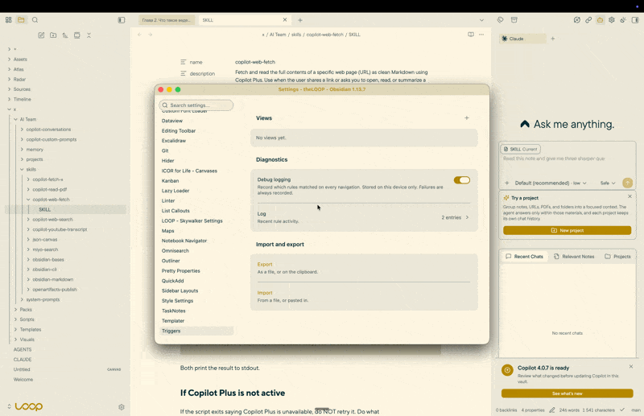

# Triggers

Runs your Obsidian commands when you open something.

A rule says where — a note, a folder, a Base, a view, a frontmatter property — and what to run when
you get there. Any command from the palette, or a QuickAdd choice with the context handed to it.



<!-- START doctoc generated TOC please keep comment here to allow auto update -->
<!-- DON'T EDIT THIS SECTION, INSTEAD RE-RUN doctoc TO UPDATE -->
## Contents

- [1 Installation](#1-installation)
- [2 What a rule looks like](#2-what-a-rule-looks-like)
- [3 Working with QuickAdd](#3-working-with-quickadd)
- [4 With Sidebar Layouts](#4-with-sidebar-layouts)
- [5 Quality](#5-quality)
- [6 Privacy](#6-privacy)
- [7 Languages](#7-languages)
- [8 Documentation](#8-documentation)
- [9 Development](#9-development)
- [10 License](#10-license)

<!-- END doctoc -->

## 1 Installation

Not in Obsidian's community plugin browser yet: a plugin is submitted there after its first release,
and appears once that submission has been reviewed. Until then, either route below installs it.

- **BRAT** — install [BRAT](https://github.com/TfTHacker/obsidian42-brat), then add
  `mrkhachaturov/obsidian-triggers` to it. It installs the latest release and follows the ones after
  it.
- **By hand** — download `main.js`, `manifest.json` and `styles.css` from the
  [latest release](https://github.com/mrkhachaturov/obsidian-triggers/releases/latest), put them in
  `<vault>/.obsidian/plugins/triggers/`, then enable the plugin under Settings → Community plugins.

Requires Obsidian 1.13.0 or later.

## 2 What a rule looks like

A rule fires when every condition you switched on matches:

| Condition | Matches |
| --- | --- |
| View type | Markdown, Bases, Canvas, and Excalidraw when that plugin is installed |
| Path | a full path, a file name, or a folder — optionally as a regular expression |
| Base view | the view shown in the Bases toolbar, such as `Kanban Board` |
| Properties | `type: task`, or just `due` for "has that property". Tags count as a property |

It then runs its actions in order. When several rules match, all of them run, top to bottom — you
can group them and change the order.

## 3 Working with QuickAdd

A QuickAdd action receives the context as variables — where you are, which rule fired, the note's
tags and every frontmatter property. QuickAdd's own conditions branch on them with its ten
operators, so "run this when the note is a task created before Friday" needs no script.

QuickAdd is optional. Without it, rules still run commands.

The full list of what is passed is in [docs/reference.md](docs/reference.md).

## 4 With Sidebar Layouts

[Sidebar Layouts](https://github.com/mrkhachaturov/obsidian-sidebar-layouts) keeps several
arrangements of a sidebar — three panels stacked for one task, one full-height panel for another —
and registers each arrangement as a command.

Triggers runs commands. Together they do something neither does alone: open a Base in its Kanban
view and the right sidebar becomes the one you built for tasks; open a note whose `type` is
`meeting` and the left sidebar turns into outline and backlinks. You set the rule once; the sidebars
follow what you open.

Neither plugin needs the other. A rule runs whatever commands you name, and a layout is switched
just as well by a hotkey.

## 5 Quality

Every change passes the same gates before it lands: [biome](https://biomejs.dev/),
[ESLint](https://eslint.org/) with the official
[Obsidian plugin](https://github.com/obsidianmd/eslint-plugin),
[TypeScript](https://www.typescriptlang.org/) with `strict` and then some,
[Vitest](https://vitest.dev/), [knip](https://knip.dev/) for dead code, and two checks of our own —
one that no translated string is unused or missing, one that the generated reference still matches
the code.

`mise run check` is the whole set, and it runs again before every push.

## 6 Privacy

No network requests of any kind. No telemetry, no update checks, no downloads.

The plugin never opens your files. To decide whether a rule matches it reads the index Obsidian has
already built — the same one the Properties panel shows — and nothing else.

Debug logging is off by default. When you turn it on, it stays in memory on that device and its
switch is stored outside your vault, so it never syncs to a machine where nobody is debugging.

## 7 Languages

The interface follows the language selected in Obsidian — the settings, the rule editor, command
names and the plugin's own messages are all translated, and English stands in wherever a translation
has not caught up. More languages are added over time: one is a file of strings and needs no other
change to the plugin.

Names you type, and labels that come from Obsidian or another plugin, are left as they are.

## 8 Documentation

| Document | What it holds |
| --- | --- |
| [docs/reference.md](docs/reference.md) | Conditions and variables. Generated from the code |

## 9 Development

```bash
mise install && mise deps       # tools, then dependencies
mise run check                  # every gate
mise run docs                   # regenerate docs/reference.md
VAULT=/path/to/vault mise run plugin:install
```

## 10 License

MIT. See [LICENSE](LICENSE).
